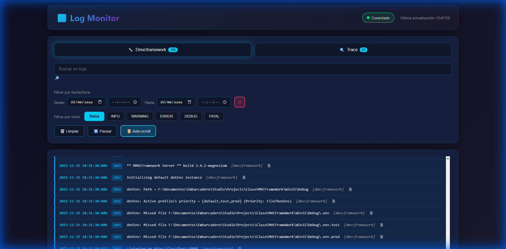
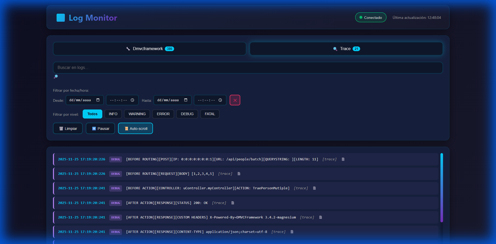

# DMVCFramework Log Viewer

Modern, high-performance web system for real-time log file monitoring with automatic tag detection, multiple folder support, and optimizations for large data volumes.

## 🚀 Quick Start

1. **Start the server:**
   ```bash
   python server.py
   ```

2. **Open in browser:**
   ```
   http://localhost:8080/index.html
   ```

## 📸 Screenshots

### Main Interface
Real-time log monitoring with dynamic tabs, filtering, and search capabilities.



### Multiple Log Types
Switch between different log types using the dynamic tab system.



## ⚙️ Configuration

### Frontend Configuration (Optional)

If you need to host the frontend on a different server than the backend (API), you can configure the server URL in the `config.js` file:

```javascript
window.AppConfig = {
    // Example: 'http://localhost:8080'
    serverUrl: '' // Leave empty if frontend and backend are on the same server
};
```

### Backend Configuration (config.json)

Edit the `config.json` file to customize the monitor's behavior.

### config.json File Structure

```json
{
  "logPatterns": [
    {
      "pattern": "*.*.*.log",
      "description": "Pattern: NAME.NUMBER.TAG.log",
      "regex": "^(.+?)\\.(\\d+)\\.(.+?)\\.log$",
      "tagGroup": 3,
      "nameGroup": 1
    }
  ],
  "scanPaths": [
    "."
  ],
  "port": 8080,
  "updateInterval": 2000,
  "maxEntriesPerTag": 500,
  "maxFileReadSize": 524288,
  "enableVirtualScroll": true,
  "autoScroll": true,
  "theme": "dark"
}
```

## 🌐 Decoupled Deployment (Separate Frontend and Backend)

You can host the frontend and backend on different servers. For example:

### Scenario: Backend on Server A, Frontend on Server B

**Server A (Backend - Log API):**
1. Edit `config.json` and set the desired port:
   ```json
   {
     "port": 9000,
     ...
   }
   ```
2. Run the server:
   ```bash
   python server.py
   ```
3. The API server will be at: `http://server-a.com:9000`

**Server B (Frontend - Web Interface):**
1. Copy the frontend files to your web server (Apache, Nginx, IIS, etc.):
   - `index.html`
   - `config.js`
   - `app.js`
   - `datetime-filter.js`
   - `performance.js`
   - `styles.css`
   - `datetime-filter.css`

2. Edit `config.js` to point to the backend:
   ```javascript
   window.AppConfig = {
       serverUrl: 'http://server-a.com:9000'
   };
   ```

3. Access the interface: `http://server-b.com/index.html`

> **Note about CORS:** If you receive CORS errors, make sure the backend server (`server.py`) is properly configured to allow requests from the frontend domain. The Python server already includes CORS headers by default.

### Configuration Parameters

#### `logPatterns` (Array)
Defines the file name patterns to search for.
- **`pattern`**: Simple glob pattern for visual reference.
- **`regex`**: Regular expression to extract information from the filename.
- **`tagGroup`**: Capture group number containing the TAG (used for tab grouping).
- **`nameGroup`**: Capture group number containing the NAME.

#### `scanPaths` (Array)
List of paths where to search for log files. You can specify multiple folders using relative or absolute paths.

**Windows Examples:**
```json
"scanPaths": [
  ".",                                    // Current folder
  "../other-logs",                       // Relative folder
  "C:/logs/application",                 // Absolute path
  "D:/projects/my-app/logs",            // Another drive
  "//remote-server/logs/production"     // Network shared folder
]
```

**Linux Examples:**
```json
"scanPaths": [
  ".",                                    // Current folder
  "../logs",                             // Relative folder
  "/var/log/myapp",                      // Absolute path
  "/home/user/projects/app/logs",       // User path
  "/mnt/storage/logs"                    // Mounted drive
]
```

> **⚠️ Important**: Avoid duplicate paths (e.g., `.` and `../LogMonitor` if they point to the same location) to prevent duplicate logs in the interface.

#### `port` (Number)
Port on which the backend server will listen (default: 8080).
- Useful when you need to run multiple monitor instances or avoid port conflicts.

#### `updateInterval` (Number)
Update interval in milliseconds (default: 2000 = 2 seconds).

#### `autoScroll` (Boolean)
Enable auto-scroll automatically on load (default: true).

### ⚡ Performance Configuration

To efficiently handle thousands of records:

#### `maxEntriesPerTag` (Number)
Maximum number of log entries to keep in memory per tag (Recommended: 500).
*This prevents the browser from consuming too much RAM.*

#### `maxFileReadSize` (Number)
Maximum size in bytes to read from the end of the file (Recommended: 524288 = 512KB).
*Allows instant loading of giant log files (GBs) by reading only the most recent part.*

#### `enableVirtualScroll` (Boolean)
  - Select end date/time in "To".
  - Use the **✕** button to quickly clear the filter.

### 3. Controls
- **🗑️ Clear**: Visually clears current logs (they will reload if you refresh).
- **⏸️ Pause**: Stops automatic updates.
- **📜 Auto-scroll**: Enables/disables automatic scrolling to the end.

## 📋 Expected Log Format

```
YYYY-MM-DD HH:MM:SS:mmm [TID    XXXXX][LEVEL   ] Message [tag]
```

**Example:**
```
2025-11-25 17:22:04:997 [TID    25512][INFO   ] Application started [dmvcframework]
```

## 🔌 API Endpoints

- **GET `/api/logs`**: List of discovered files.
- **GET `/api/config`**: Current configuration.
- **GET `/api/refresh`**: Forces file re-scanning.

## 🐛 Common Troubleshooting

### Duplicate Logs
If you see double the expected logs, check `scanPaths` in `config.json`. Make sure you're not scanning the same folder from two different paths (e.g., `.` and `../logs`).

### New Files Don't Appear
Auto-discovery runs every 10 seconds. Wait a moment. If they don't appear, verify that the filename matches `logPatterns`.

### Slow Interface
Make sure you have `"enableVirtualScroll": true` and `"maxEntriesPerTag": 500` enabled in `config.json`.
